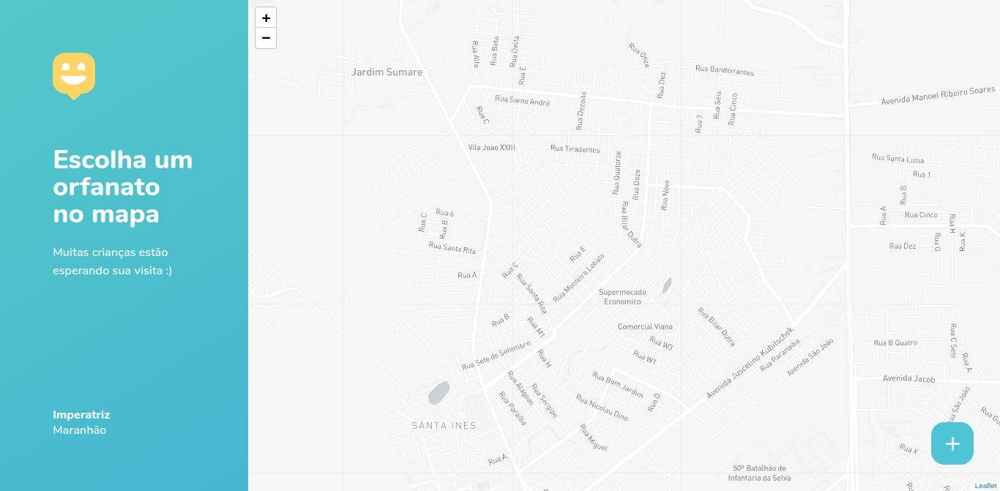

<div align="center">


</div>

### Getting Started 🚀

#### Cloning

```ps
# Clone the repository using git
$ git clone https://github.com/JuanPabllo/Happy.git
```

#### Requirements

- [Node.js](https://nodejs.org/en/)
- [Yarn](https://yarnpkg.com/) or [npm](https://www.npmjs.com/)
- [Expo](https://expo.io/)

##### Web

This project use third party dependencies that need to be installed, use that command to install all needed dependencies

```ps
$ cd web
$ yarn install
```

##### Backend

This project use third party dependencies that need to be installed, use that command to install all needed dependencies

```ps
$ cd Backend
$ yarn install
```

#### Running

To start the Web Server run the command

```ps
# Entering in web directory
$ cd web

# Run the web server
$ yarn start
```

To start the Back Server run the command

```ps
# Entering in Server directory
$ cd backend

# Run the Back Server
$ yarn dev
```

#### Screenshot Web





